# SiamFeast（暹罗盛宴）用户手册

> **版本**：v1.0.11 ｜ **适用对象**：终端用户（食客） ｜ **更新日期**：2026-08-11
> **支持语言**：中文 / English / ภาษาไทย（文中以 `中文 / English / ภาษาไทย` 三语对照标注）

---

## 📖 目录

1. [App 概览与底部导航](#1-app-概览与底部导航)
2. [登录与注册](#2-登录与注册)
   - 2.1 [密码登录页（默认入口）](#21-密码登录页默认入口)
   - 2.2 [短信验证码登录页](#22-短信验证码登录页)
   - 2.3 [独立密码登录页](#23-独立密码登录页)
   - 2.4 [注册页](#24-注册页)
3. [首页](#3-首页)
4. [堂食点餐](#4-堂食点餐)
   - 4.1 [堂食门店列表](#41-堂食门店列表)
   - 4.2 [堂食点餐页](#42-堂食点餐页)
5. [商城与商品](#5-商城与商品)
   - 5.1 [商城首页](#51-商城首页)
   - 5.2 [商品列表页](#52-商品列表页)
   - 5.3 [商品详情页](#53-商品详情页)
6. [购物车与结算](#6-购物车与结算)
   - 6.1 [结算页](#61-结算页)
   - 6.2 [支付成功页](#62-支付成功页)
7. [我的订单](#7-我的订单)
   - 7.1 [订单列表](#71-订单列表)
   - 7.2 [订单详情](#72-订单详情)
8. [会员中心（我的）](#8-会员中心我的)
9. [优惠券](#9-优惠券)
10. [积分商城（兑换）](#10-积分商城兑换)
11. [邀请好友（推荐）](#11-邀请好友推荐)
12. [任务中心](#12-任务中心)
13. [会员码](#13-会员码)
14. [消息中心](#14-消息中心)
15. [活动与营销](#15-活动与营销)
    - 15.1 [活动详情弹窗](#151-活动详情弹窗)
    - 15.2 [新人礼包](#152-新人礼包)
    - 15.3 [拼团](#153-拼团)
16. [收货地址](#16-收货地址)
17. [设置](#17-设置)
18. [常见问题（FAQ）](#18-常见问题faq)

---

## 1. App 概览与底部导航

SiamFeast 是一款集**堂食点餐、外卖下单、会员积分、优惠领券、邀请有礼**于一体的餐饮 App。打开 App 后，绝大多数主页面底部都有一个固定的**底部导航栏（TabBar）**，用于在三大主功能之间切换：

| Tab | 图标 | 中文 / English / ภาษาไทย | 跳转页面 |
|-----|------|--------------------------|----------|
| 🏠 首页 | 房子图标 | 首页 / Home / หน้าแรก | `pages/index/index` |
| 📋 订单 | 订单图标 | 订单 / Orders / คำสั่งซื้อ | `pages/order/index` |
| 👤 我的 | 人物图标 | 我的 / Me / ของฉัน | `pages/member/index` |

> 💡 **提示**：当前所在 Tab 的图标会变成**金黄色**（#F2B131）。底部 TabBar 在登录后才会出现，未登录时会被引导到登录页。

---

## 2. 登录与注册

### 2.1 密码登录页（默认入口）

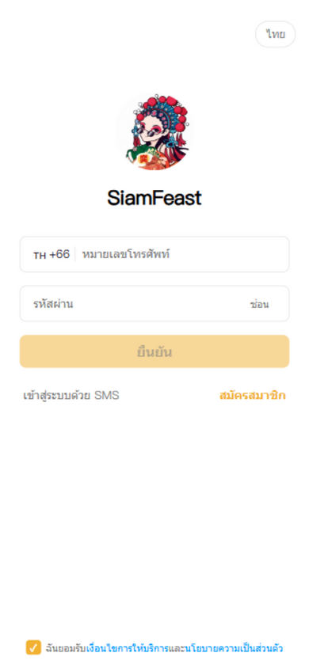

**页面用途**：App 启动后的默认登录页，使用「手机号 + 密码」登录。

**布局（从上到下）**：

| 区域 | 文案（中 / EN / ไทย） | 操作说明 |
|------|----------------------|----------|
| ① 语言切换 | `ไทย` / `EN` / `中文`（右上角） | 点击循环切换语言：中文 → English → ภาษาไทย。切换后全 App 立即生效，Toast 提示"语言切换成功"。 |
| ② Logo | `SiamFeast` | 品牌标识，无交互。 |
| ③ 手机号输入框 | 占位符：`请输入手机号 / Phone number / หมายเลขโทรศัพท์` | 左侧固定显示泰国区号 🇹🇭 `+66`。请输入 9 位手机号（不含 0 开头）。 |
| ④ 密码输入框 | 占位符：`请输入密码 / Password / รหัสผ่าน` | 输入至少 6 位密码。右侧「`隐藏/显示 / Hide/Show / ซ่อน`」按钮可切换明文/密文显示。 |
| ⑤ 登录按钮 | `确认 / Confirm / ยืนยัน`（黄色大按钮） | 校验手机号 + 是否勾选协议 → 调用登录接口 → 成功后 1.5 秒进入首页。错误时提示"手机号或密码错误"。 |
| ⑥ 短信登录链接 | `短信登录 / SMS Login / เข้าสู่ระบบด้วย SMS`（左下） | 跳转到短信验证码登录页。 |
| ⑦ 注册账号链接 | `注册账号 / Create Account / สมัครสมาชิก`（右下，黄色高亮） | 跳转到注册页。 |
| ⑧ 第三方登录 | `Google` / `Facebook` 按钮（仅 APP 端显示） | 拉起系统 OAuth 授权窗口完成登录。 |
| ⑨ 协议勾选 | `我已阅读并同意《服务条款》和《隐私政策》` | **必须勾选**才能登录。点击蓝字可跳转查看完整协议条款。 |

> ⚠️ **注意**：必须勾选底部的协议勾选框后，登录按钮才会生效。未勾选时点击登录会提示"请先同意服务条款"。

---

### 2.2 短信验证码登录页

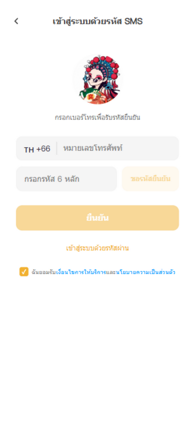

**页面用途**：用手机号 + 短信验证码登录（无需密码）。

**布局与按钮**：

| 区域 | 文案 | 操作说明 |
|------|------|----------|
| ① 返回按钮 | ←（左上角） | 返回上一页。 |
| ② 标题 | `短信验证码登录 / SMS Login` | — |
| ③ 手机号输入框 | `请输入手机号` | 带 +66 区号。 |
| ④ 验证码输入框 + 获取按钮 | 右侧按钮：`获取验证码 / Get Code`，倒计时显示 `60s` | 点击发送验证码。未注册手机号会弹窗引导去注册。60 秒内不可重复发送。 |
| ⑤ 登录按钮 | `确认 / Confirm`（黄色） | 输入验证码后点击登录。新用户首次登录会弹出**邀请码填写弹窗**。 |
| ⑥ 密码登录链接 | `密码登录 / Password Login` | 切换回密码登录页。 |

> 📧 **邮箱降级模式**：当短信额度用完时，页面会自动切换为**邮箱验证码模式**，多出一个邮箱输入框，验证码会发送到邮箱。

**新用户邀请码弹窗**（首次登录后出现）：

- 标题：`有邀请码吗？` 🎁
- 输入框：`邀请码（选填）`
- 按钮「跳过 / Skip」：不绑定，直接进首页。
- 按钮「绑定 / Bind」：填写好友邀请码，双方获奖励。

---

### 2.3 独立密码登录页

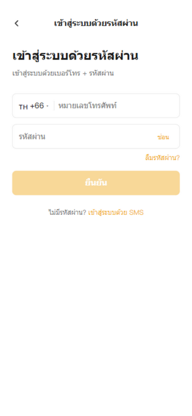

**页面用途**：带返回导航栏的独立密码登录页（从短信登录页切换过来）。

与默认登录页（2.1）功能一致，区别是：
- 顶部有返回箭头和标题栏「`密码登录 / Password Login`」
- 密码框下方多了「**忘记密码? / Forgot password?**」链接 —— 点击后跳转到短信验证码页，验证身份后可重置密码
- 底部有「没有密码?」+「**短信登录**」切换链接

---

### 2.4 注册页

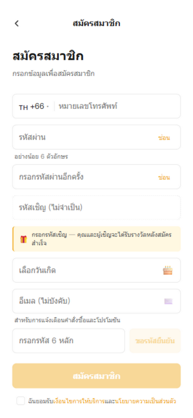

**页面用途**：新用户注册账号。

**布局（从上到下）**：

| 序号 | 字段 | 说明 |
|------|------|------|
| ① | 返回 + 标题 `注册账号 / Create Account` | — |
| ② | 手机号 | 带 +66 区号 |
| ③ | 密码 | 至少 6 位，右侧可切换显示 |
| ④ | 确认密码 | 两次输入必须一致 |
| ⑤ | 邀请码（选填） | 虚线边框输入框。下方黄色提示卡："填写邀请码，注册成功后你和邀请人都可获奖励"。填好后显示绿色"✓ 已填写"。**支持分享链接自动带入**（URL 带 `invite_code` 参数）。 |
| ⑥ | 生日 | 点击 🎂 弹出日期选择器（用于生日奖励） |
| ⑦ | 邮箱（可选） | "用于接收订单和优惠通知" |
| ⑧ | 短信验证码 + 获取按钮 | 先校验手机号是否已注册，未注册才发码 |
| ⑨ | 注册按钮 `注册 / Register` | 提交注册，成功后自动登录进入首页 |
| ⑩ | 协议勾选 | 必须勾选 |

> 💡 **小贴士**：填写好友的邀请码注册，你和好友都能获得金币/积分奖励！

---

## 3. 首页

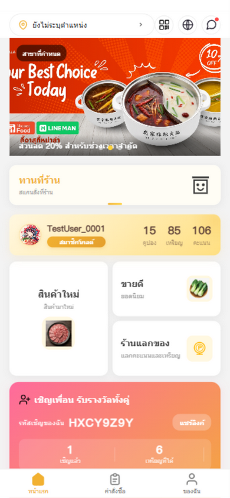

**页面用途**：App 主首页，聚合了门店、堂食、会员、活动、邀请等所有核心入口。

**布局（从上到下）**：

### 🔝 顶部导航栏

| 位置 | 元素 | 功能 |
|------|------|------|
| 左侧 | 📍定位图标 + 门店名 + ▼ | **门店选择器**：点击进入「门店选择」页，切换当前消费门店 |
| 右侧 ① | 📱二维码图标 | 进入「**会员码**」页，出示给收银员识别会员 |
| 右侧 ② | 🌐地球图标 | 弹出「语言切换」弹窗 |
| 右侧 ③ | 🔔消息图标（有未读显红点） | 进入「消息中心」 |

### 🖼️ Banner 轮播图
- 自动每 4 秒切换，**点击横幅**可跳转到对应活动 / 商品 / 页面。
- 部分活动横幅左上角显示「全部门店 / 指定门店」徽章，特殊日期活动（如双号日）显示「今日可领」红色角标。

### 🏠 堂食入口卡（黄色高亮卡）
- 文案：`堂食 / Dine In` + `到店扫码下单`
- 点击 → 进入「堂食门店列表」，选择门店后可扫码或在线点餐。

### 💳 会员信息卡（金色渐变卡）

| 元素 | 功能 |
|------|------|
| 头像 + 昵称 + 会员等级 | 点击 → 进入「设置」页 |
| `优惠券 N` | 点击 → 进入「我的优惠券」 |
| `金币 N` | 点击 → 进入积分商城的「金币兑换」Tab |
| `积分 N` | 点击 → 进入积分商城的「积分兑换」Tab |

### 🔲 功能入口区（2×2 网格）

| 卡片 | 文案 | 跳转 |
|------|------|------|
| 左大卡 | `新品上市 / New Arrivals` | 新品商品列表 |
| 右上 | `热销榜单 / Best Sellers` | 热销商品列表 |
| 右下 | `兑换商城 / Redeem Mall` | 积分商城 |

### 🎁 邀请好友拓客卡（粉金渐变，有邀请码时显示）

| 元素 | 功能 |
|------|------|
| 邀请码（如 `HXCY9Z9Y`） | 你的专属邀请码 |
| `分享链接 / Share Link` 按钮 | 复制注册邀请链接到剪贴板，可发给好友 |
| 已邀请 / 已赚金币 / 待激活 | 邀请统计 |
| 进度条（邀请 3 / 5 / 10 人档位） | 达标解锁奖励，未达标显示 🔒 锁图标 |

### 📣 活动小条列表
每条显示：活动类型标签（`折扣/满减/领券/活动`）+ 活动名 + 描述 + 右侧操作：
- 有可领优惠券 → 「**立即抢券 / Grab Coupon**」按钮
- 否则 → 「›」箭头
- 点击任意一条 → 弹出「活动详情弹窗」

---

## 4. 堂食点餐

### 4.1 堂食门店列表

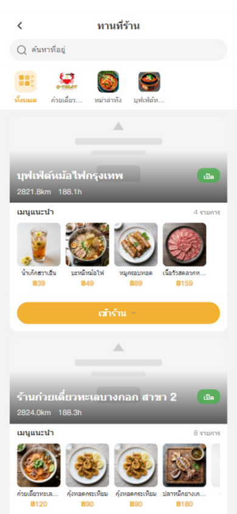

**页面用途**：选择要堂食就餐的门店。

**布局**：

| 区域 | 说明 |
|------|------|
| 返回 + 标题 `堂食 / Dine In` | 顶部导航栏 |
| 搜索框 | 占位符 `搜索地址`，可搜索门店 |
| 分类标签横滑 | `全部` + 各经营分类（如`海鲜粉`、`麻辣烫`、`火锅自助`），点击筛选 |
| 门店卡片列表 | 每张卡显示：门店 Banner、店名、营业状态（`营业中 🟢 / 休息中 🔴`）、距离/骑行/步行时间、营业时间、招牌菜品横滑、**「进店」按钮** |

**操作**：
- 点击门店卡片或「**进店 / เข้าร้าน**」按钮 → 进入该门店的堂食点餐页
- 点击招牌菜品图 → 直接进入该菜品详情页

---

### 4.2 堂食点餐页

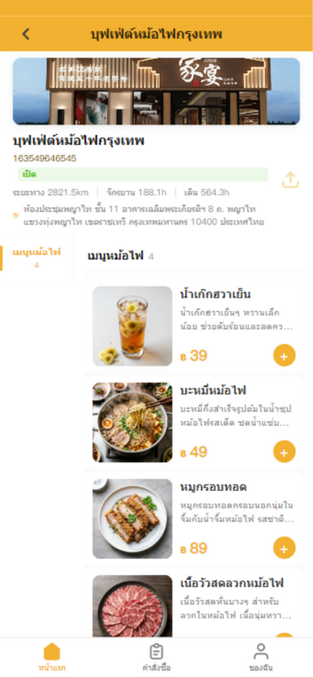

**页面用途**：单门店堂食点餐核心页（类似美团/大众点评的左右双栏布局）。

### 顶部信息区

| 元素 | 功能 |
|------|------|
| 返回 + 门店名 | （连点门店名 5 次可激活开业测试模式） |
| 门店 Banner 图 | 展示 |
| 店名 + 电话 + 营业时间 + 营业状态徽章 | 门店基本信息 |
| 距离 / 骑行 / 步行时长 | 距离信息 |
| 地址行 | **点击打开 Google Maps 导航** |
| 分享图标 | 分享门店给好友 |

### 🎉 开业横幅（活动期间显示）
- 显示「开业活动进行中 剩 N 天」+ 权益标签（额外积分/金币/折扣）
- 「**领取开业券 / Claim Opening Coupon**」按钮：点击领取，成功后弹窗显示券详情，可选「立即使用」或「我的券包」

### 📋 左右双栏点餐区

| 栏位 | 说明 |
|------|------|
| **左侧分类列表** | 所有菜品分类。点击分类 → 右侧自动滚动到对应分组，当前分类高亮（黄色左边线） |
| **右侧菜品列表** | 按分组 sticky 展示。每道菜：图片 + 名 + 标签 + 描述 + 价格 + 原价划线 + 圆形「**+**」加购按钮 |

### 🛒 购物车

| 元素 | 功能 |
|------|------|
| 右下角悬浮购物车按钮（有商品时显示） | 显示购物车图标 + 商品数量红点。**点击展开购物车面板** |
| 购物车面板（底部弹出） | 列表：商品图 + 名 + 规格 + 小计 + 「−」「+」数量调节。顶部「**清空**」按钮可清空购物车 |
| 「**去结算 / Checkout**」按钮 | 提交到结算页 |

**规格选择弹窗**（有规格的商品点击 + 时弹出）：
- 商品概要（图 + 名 + 实时价格）
- 规格组：单选规格（如辣度）、口味、多选加料（显示「+฿X」加价）
- 数量「−」「+」
- 底部「**加入购物车**」+「**立即购买**」按钮

> ⚠️ **关业提示**：商家已关业时首次加购，会弹确认框"商家已关业...确定要下单吗？"，可选「继续下单」或「再想想」。售罄商品点击会提示"商品已售罄"。

---

## 5. 商城与商品

### 5.1 商城首页

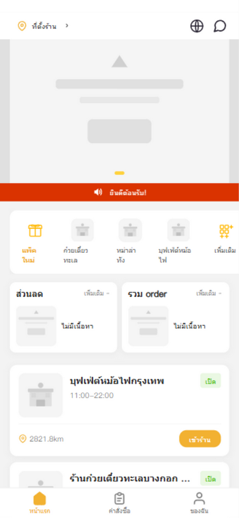

**页面用途**：外卖/商城总入口，按分类浏览商家和商品。

**布局**：

| 区域 | 功能 |
|------|------|
| 顶部导航 | 门店选择器 + 语言图标 + 消息图标 |
| Banner 轮播 | 点击按类型跳转商品/页面 |
| 🔴 公告条 | 红色横条，小喇叭图标 + 公告文字 |
| 分类标签横滑 | `新人券包` + 各经营分类 + `更多`。点「新人券包」→ 新人礼包页；点分类 → 进入对应商品列表 |
| 优惠 / 拼单专区 | 两张并排卡片，分别进入「优惠专区」和「拼团」页 |
| 商家列表 | 按距离排序。每卡：logo + 名 + 营业状态 + 营业时间 + 经营类型 + 距离/地址 + 「**进店**」按钮 |
| 「进店」按钮 | 进入该商家堂食/外卖点餐页 |

---

### 5.2 商品列表页

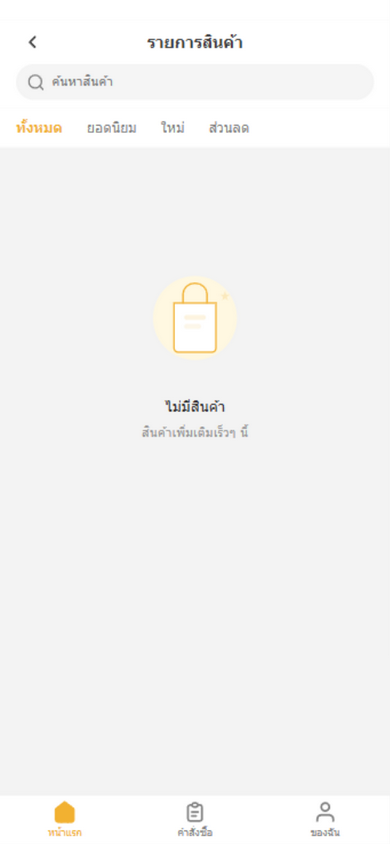

**页面用途**：浏览某一分类下的商品或门店。

**两种模式**：

**门店模式**（带 `businessType` 参数）：
- 门店卡片列表：Banner + 店名 + 营业状态 + 招牌菜品横滑 + 地址 + 「进店」按钮

**商品模式**：
- 筛选标签栏：`全部 / 热销 / 新品 / 优惠`
- 商品卡列表：图片 + 新品角标 + 店名 + 商品名 + 价格 + 原价划线 + 销量 + 「**立即购买**」按钮
- 点卡片 → 商品详情；点「立即购买」→ 直接进入结算

| 元素 | 功能 |
|------|------|
| 返回 + 分类名标题 | 导航 |
| 搜索框 | `搜索商品`，输入后按确认键搜索，有「×」清空按钮 |

---

### 5.3 商品详情页

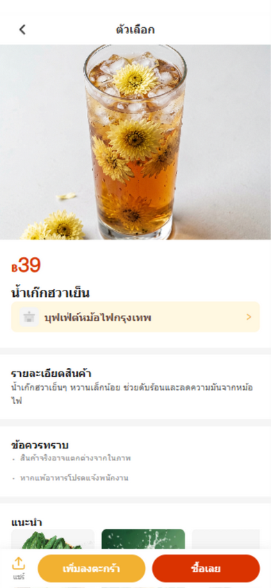

**页面用途**：查看单个菜品详情、加购、立即购买。

**布局（从上到下）**：

| 区域 | 说明 |
|------|------|
| 返回 + 标题 `规格 / Options` + ⭐收藏按钮 | 右上角星标可**收藏/取消收藏**商品 |
| 商品大图 | 新品显示红色角标 |
| 价格区 | 大红色 ฿ 价格 + 原价划线 |
| 商品名 + 所属门店行（黄底） | 点击门店行 → 跳转该门店堂食页 |
| 标签 / 销量 / 回头客 / 周售统计 | 商品数据 |
| 商品详情卡 | 详情图 + 描述文字 |
| 购买须知 | "商品以实物为准"、"过敏食材请告知店员" |
| 更多推荐 | 横滑商品卡，点击跳转 |

**底部固定购买栏**：

| 按钮 | 功能 |
|------|------|
| 左：📤 `分享 / Share` | 生成分享链接复制到剪贴板，弹分享弹窗 |
| 中：🟡 `加入购物车 / Add to Cart` | 有规格时先弹规格选择弹窗，确认后加入购物车 |
| 右：🔴 `立即购买 / Buy Now` | 有规格时先弹规格弹窗，确认后直接跳结算页 |

---

## 6. 购物车与结算

### 6.1 结算页

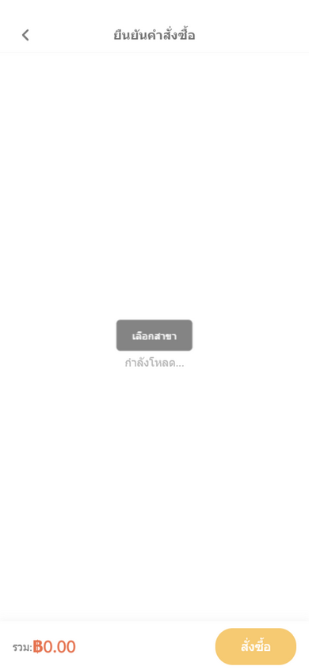

**页面用途**：确认订单信息并提交（堂食/外卖通用）。

**布局**：

| 区域 | 说明 |
|------|------|
| 返回 + 标题 `确认订单 / Checkout` | 导航 |
| 🏪 门店信息卡 | 定位图标 + 门店名 + 地址 |
| 📦 商品列表 | 每项：图 + 名 + 规格 + 单价 + 数量 |
| 🎟️ 优惠券区 | 显示「**优惠券 N 张可用**」，点击弹优惠券选择弹窗。纯酒水订单显示「🚫 该订单不参与优惠」 |
| 🪙 金币抵扣区（有金币且非酒水订单时） | 开关 switch + 金币档位卡片（「用 X 金币抵 ฿Y」，单选） |
| 💰 费用明细 | 商品费用 + 活动折扣（🎉 −฿X）+ 优惠券 + 金币抵扣 + **合计** + 预计获得金币🪙/积分⭐ |
| 📝 备注输入框 | `选填，请输入备注信息` |
| 底部固定栏 | 左：「**合计：฿X**」 右：「**提交订单 / Place Order**」按钮（提交中显示"提交中..."） |

**优惠券选择弹窗**：
- 标题「选择优惠券」+ 关闭 ×
- 列表每项：金额 + 名 + 描述/不可用原因 + 勾选
- 底部「**不使用优惠券**」选项
- 不可用券显示灰色（防折上折）

> 💡 **业务说明**：本 App 采用"先吃后付"模式，提交订单后会生成一个二维码，到收银台扫码完成支付，无需在 App 内付款。

---

### 6.2 支付成功页

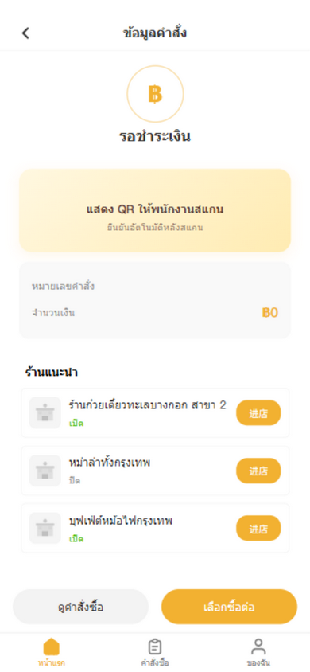

**页面用途**：订单提交后，展示二维码让收银员扫码，并轮询确认支付状态。

**布局**：

| 区域 | 说明 |
|------|------|
| 返回 + 标题 `订单信息 / Order Info` | 导航 |
| 状态区 | 待支付：脉冲动画 + 「等待支付」；已支付：✅ 成功图标 + 「支付完成」 |
| 二维码卡（未支付时） | QR 图 + 「请将二维码出示给收银员」+「收银员扫码后自动确认」 |
| 订单信息卡 | 订单号 + 金额 + 已支付徽章 |
| 好店推荐 | 3 个门店卡 + 「进店」按钮 |
| 底部双按钮 | 「**查看订单**」→ 订单列表；「**继续购物**」→ 首页 |

> 🔄 **自动确认**：页面每 5 秒查询一次订单状态，收银员扫码确认后自动切换为"支付完成"并震动反馈。

---

## 7. 我的订单

### 7.1 订单列表

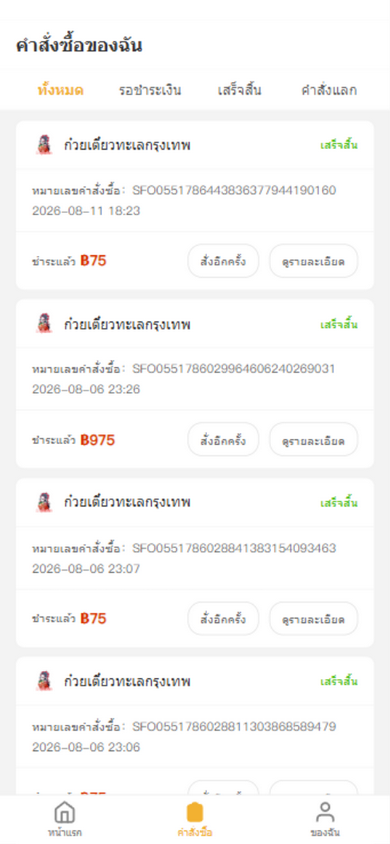

**页面用途**：查看所有订单（普通订单 + 兑换订单）。

**顶部状态 Tab**：

| Tab | 说明 |
|-----|------|
| `全部` | 所有订单 |
| `待付款` | 等待支付的订单 |
| `已完成` | 已完成的订单 |
| `兑换订单` | 积分/金币兑换的订单 |

**普通订单卡**：

| 元素 | 说明 |
|------|------|
| 店名 + logo + 订单状态 | 状态：待付款（黄）/ 已完成（绿）/ 已取消（灰） |
| 订单号 + 下单时间 + 金币使用 + 实付金额 | 订单基本信息 |
| 「**去支付 / Pay Now**」按钮（待付款） | 跳转到支付成功页展示二维码 |
| 「**再来一单 / Reorder**」按钮 | 带商品列表跳转到结算页，快速复购 |
| 「**查看详情 / Details**」 | 进入订单详情页 |

**兑换订单卡**（兑换 Tab）：

| 元素 | 说明 |
|------|------|
| 商品图 + 名 + 兑换类型标签（金币/积分） | — |
| 成本 + 时间 | — |
| 「**查看兑换码 / View Code**」按钮 | 待核销时显示，跳转兑换成功页查看二维码 |
| 「**查看详情**」 | — |

> 💡 空状态显示「暂无订单 / 快去品尝美食吧」。

---

### 7.2 订单详情

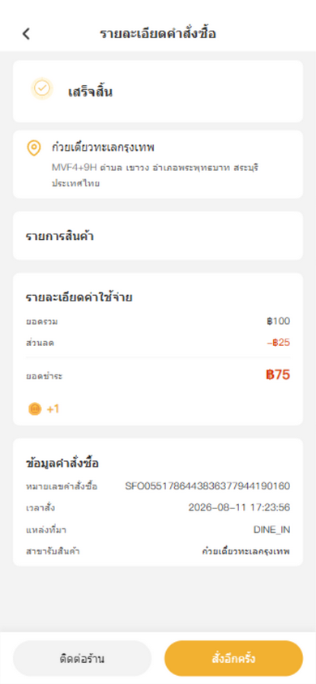

**页面用途**：查看单笔订单的完整详情。

**布局**：

| 区域 | 说明 |
|------|------|
| 返回 + 标题 `订单详情 / Order Details` | 导航 |
| 订单状态卡 | 图标 + 状态文字 + 桌号「桌号：X」 |
| 二维码卡（待支付时） | QR 图 + 「请将二维码出示给收银员」 |
| 门店信息 | 店名 + 地址 |
| 商品列表 | 图 + 名 + 规格 + 单价 + 数量 + 小计 |
| 费用明细 | 商品小计 / 优惠减免 / 金币抵扣 / 获得金币🪙 / 获得积分⭐ / 实付金额 |
| 订单信息 | 订单编号 / 下单时间 / 订单来源（扫码点餐/柜台点餐/自提/外卖）/ 提货门店 / 提货时间 / 备注 / 支付时间 |
| 底部操作栏 | 左：「**联系商家**」拨打电话；右：「**再来一单**」 |

---

## 8. 会员中心（我的）

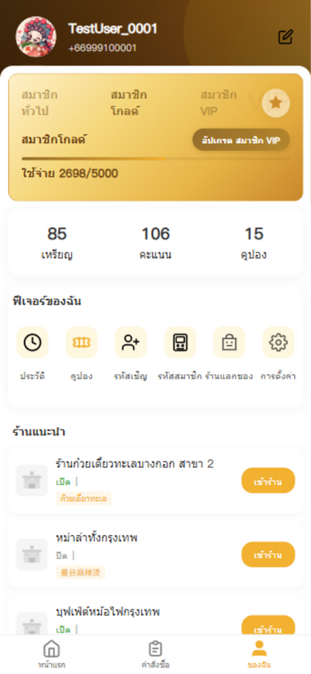

**页面用途**：「我的」Tab 主页，会员等级、功能入口、好店推荐。

**布局（从上到下）**：

### 👤 用户信息行
- 头像 + 昵称 + 手机号 + 编辑按钮
- 点击 → 进入「设置」页
- 未登录时点击 → 跳转登录页

### 🏆 会员等级区域

| 元素 | 说明 |
|------|------|
| 所有档位名平铺 | 当前档位高亮显示 |
| 当前档位图标 + 状态 | — |
| 「**升级 XXX**」按钮 | 非最高档时显示，点击跳转积分商城 |
| 进度条 + 「消费 X/Y」 | 距离下一档的进度 |
| 档位权益描述 | 最高档显示「已达最高档」 |

### 📊 统计三格

| 统计项 | 点击跳转 |
|--------|----------|
| `金币` | 金币明细 |
| `积分`（有待激活时显 +N） | 积分商城 |
| `优惠券` | 新人券包 |

### 🔧 我的功能区（图标网格）

| 图标 | 功能 | 跳转 |
|------|------|------|
| 👣 `足迹` | 浏览历史 | 足迹页 |
| 🎟️ `优惠券` | 我的优惠券 | 优惠券页 |
| 🎁 `邀请码` | 邀请好友 | 邀请页 |
| 📱 `会员码` | 出示会员码 | 会员码页 |
| 🛒 `兑换商城` | 积分兑换 | 积分商城 |
| ⚙️ `设置` | 账号设置 | 设置页 |

### 🏪 好店推荐
- 门店列表（logo + 名 + 状态 + 营业时间 + 标签 + 「进店」按钮）

### 🚪 退出登录
- 底部按钮，点击弹确认框「确定要退出登录吗？」

---

## 9. 优惠券

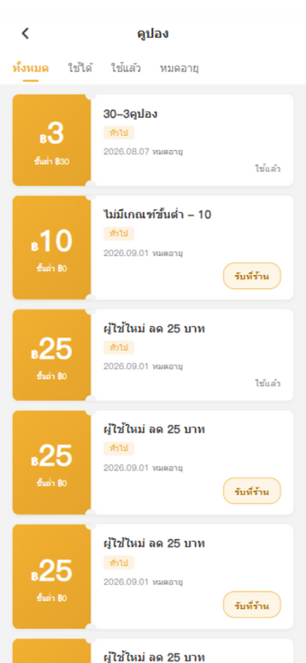

**页面用途**：查看和管理我的优惠券。

**布局**：

| 区域 | 说明 |
|------|------|
| 标题 `优惠券 / Coupons` | 导航 |
| 分类 Tab | `全部 / 可用 / 已使用 / 已过期` |
| 优惠券卡列表（票券样式，左右两圆缺口） | 见下 |

**优惠券卡结构**：

| 左侧 | 右侧 |
|------|------|
| 金额（฿X 或折扣 %）+ 「满X可用」或「菜品券·到店核销」 | 券名 + 类型标签 + 有效期 + 描述 |

**操作按钮**：
- 可用券：「**线下核销 / Redeem In-Store**」按钮 → 弹出二维码弹窗
- 不可用券：显示状态文字（已使用/已过期）

**线下核销弹窗**：
- 显示二维码 + 券号
- 「请到门店收银台出示此二维码进行核销」
- ⚠️「请当场出示，截图可能无效」

> 💡 空状态显示「暂无优惠券 / 去领券中心看看吧」。

---

## 10. 积分商城（兑换）

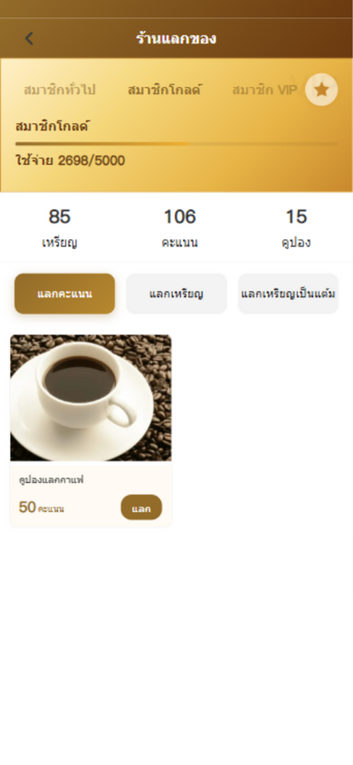

**页面用途**：用积分或金币兑换商品，以及金币换积分。

**布局**：

| 区域 | 说明 |
|------|------|
| 标题 `兑换商城 / Redeem Mall` | 导航 |
| 会员等级区域 | 同会员中心样式 |
| 统计三格 | 金币 / 积分 / 优惠券（可点击） |

**三个 Tab**：

| Tab | 内容 |
|-----|------|
| `积分兑换` | 积分兑换商品网格：图 + 名 + 积分价 + 「**兑换 / Redeem**」按钮 |
| `金币兑换` | 金币兑换商品网格：同上，用金币 |
| `金币换积分` | 比例「1 : N」+ 金币输入框 + 快捷金额芯片 + 预计获得积分 + 「**确认兑换**」按钮 |

**兑换弹窗**（兑换实物商品时）：
- 门店单选列表
- 提货时间选择（需提前 24 小时，校验通过显示「✓ 时间有效」）
- 「取消」/「**兑换**」按钮

---

## 11. 邀请好友（推荐）

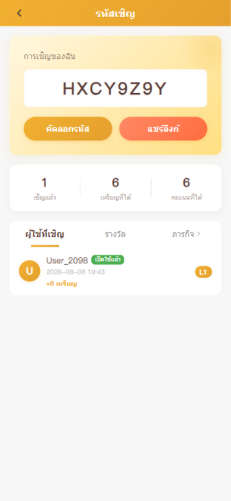

**页面用途**：查看邀请码、邀请统计、被邀请用户和奖励记录。

**布局**：

### 🎴 邀请码卡（渐变背景）

| 元素 | 功能 |
|------|------|
| 「我的邀请」+ 大号邀请码 | 你的专属邀请码 |
| 「**复制邀请码 / Copy Code**」 | 复制码到剪贴板，Toast「已复制」 |
| 「**分享链接 / Share Link**」 | 复制注册链接到剪贴板，弹分享指引弹窗 |

### 📊 统计三格
- 已邀请 / 获得金币 / 获得积分

### 🔔 待激活积分提示（有待激活时显示）

### 📑 三个 Tab

| Tab | 内容 |
|-----|------|
| `已邀请用户` | 头像 + 昵称 + 激活徽章（已激活🟢/待激活🟡）+ 日期 + 获得金币 + L1/L2 等级 |
| `奖励记录` | 类型（注册奖励/首单奖励/订单返利）+ 订单号 + 日期 + 「+N 金币/积分」 |
| `任务记录 ›` | 点击跳转任务中心 |

### 📋 分享指引弹窗
- 🔗 + 「如何分享给好友」+ 四步说明
- 「我知道了」按钮 + 「邀请链接已复制」提示

---

## 12. 任务中心

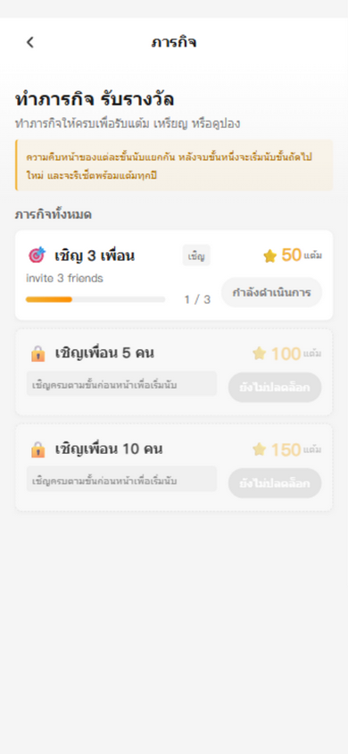

**页面用途**：完成邀请任务赚取奖励。

**布局**：

| 区域 | 说明 |
|------|------|
| 标题 `任务中心 / Task Center` | 导航 |
| 头部「做任务，赚奖励」+ 副标题 + 邀请任务规则提示条 | 任务说明 |
| 任务卡列表 | 每卡：任务名 + 进度 + 奖励 + 「**领取 / Claim**」按钮 |

**领取按钮状态**：
- 🟡 未完成（灰色，不可点）
- 🟢 可领取（亮色，可点）
- ⚫ 已领取（灰色）

**领取成功弹窗**：
- 🎉 + 「领取成功」+ 奖励图标/数额/单位 + 「**确认**」按钮

> 💡 支持下拉刷新。

---

## 13. 会员码

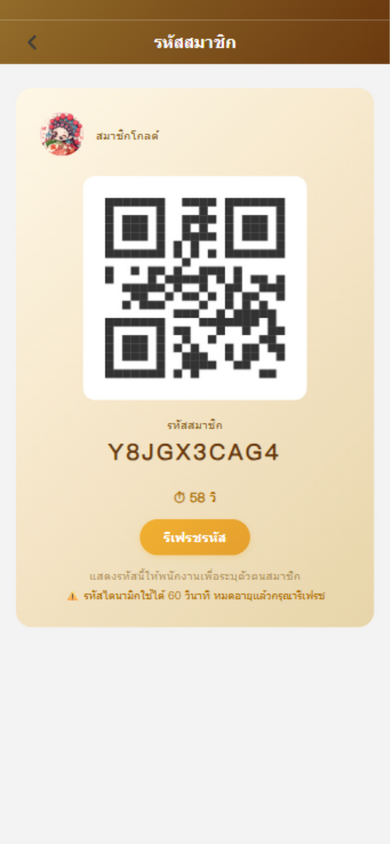

**页面用途**：生成动态会员二维码，出示给收银员识别会员身份。

**布局**：

| 区域 | 说明 |
|------|------|
| 标题 `会员码 / Member Code`（深棕渐变） | 导航 |
| 用户行 | 头像 + 昵称 + 等级名 |
| 二维码图 | 动态生成 |
| 「会员码」标签 + 10 位字母数字码 | 你的会员码 |
| ⏱ 倒计时 `Xs` | 60 秒有效期 |
| 「**刷新会员码 / Refresh Code**」按钮 | 手动刷新（加载中显示"加载中..."） |
| 提示「出示此码给收银员可识别会员身份」 | — |
| ⚠️ 警告「动态码 60 秒有效，过期请刷新」 | 安全提示 |

> 🔄 二维码每 60 秒自动刷新一次，页面重新显示时若过期也会自动刷新。

---

## 14. 消息中心

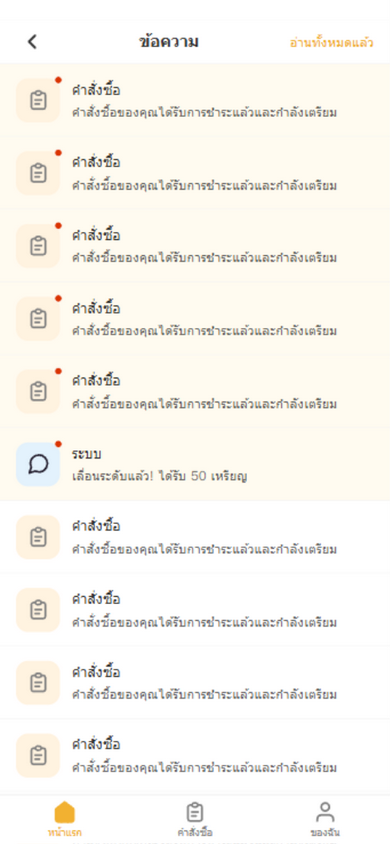

**页面用途**：查看站内通知消息。

**布局**：

| 区域 | 说明 |
|------|------|
| 返回 + 标题 `消息 / Messages` + 右上「**全部已读**」 | 有未读时显示「全部已读」按钮 |
| 消息列表 | 每项：类型图标 + 未读红点 + 标题 + 时间 + 描述 |

**操作**：
- 点击消息 → 标记已读 + 按类型跳转（订单消息 → 订单页；优惠消息 → 优惠券页）
- 「**全部已读 / Mark all read**」→ 一键标记所有消息为已读

> 💡 空状态显示「暂无消息 / 有新消息时我们会通知你」。

---

## 15. 活动与营销

### 15.1 活动详情弹窗

**页面用途**：首页 Banner / 活动条点击后弹出的活动详情（底部弹窗）。

**布局**：

| 区域 | 说明 |
|------|------|
| 关闭 × | 右上角关闭弹窗 |
| 活动 Banner 大图 | — |
| 标题区 | 类型图标 + 活动名 + 活动期（特殊日期活动显示如「双号日」）+ 类型标签 |

**折扣/满减类活动**（isDiscountType）：
- 「活动规则」标题 + 规则描述
- 高亮规则：「💰 满X减Y」或「🏷️ 全场X% off」
- 最低消费 / 日期模式 / 额外奖励🎁 / 适用门店范围📍
- 「不与其他活动叠加」、「下单时自动应用」

**领券类活动**（COUPON_GRANT / SPECIAL_DATE）：
- 「可领优惠券」标题
- 优惠券卡列表：金额 + 门槛 + 券名 + 剩余「X/Y 张」+ 有效期 + 「**立即抢券 / 已领取 / 已抢光**」按钮

**底部 CTA**：
- 折扣类：「**立即下单 / Order Now**」→ 跳堂食门店列表
- 领券类：「**我的优惠券 →**」→ 跳券包页

---

### 15.2 新人礼包

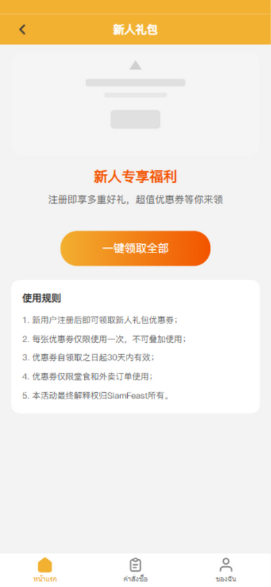

**页面用途**：新用户专享优惠券礼包。

**布局**：

| 区域 | 说明 |
|------|------|
| 标题 `新人礼包`（黄色导航栏） | — |
| 顶部横幅 | 装饰图 |
| 礼包说明 | 「注册即享多重好礼」 |
| 已领取提示 | 「礼包已全部领取」 |
| 优惠券列表（票券样式） | 每张：金额 + 门槛 + 名 + 有效期 + 「**立即领取 / 已领取**」按钮 |
| 「**一键领取全部**」按钮 | 批量领取所有可用券 |
| 使用规则 | 5 条：新用户可领 / 不可叠加 / 30 天有效 / 堂食外卖通用 / 解释权 |

---

### 15.3 拼团

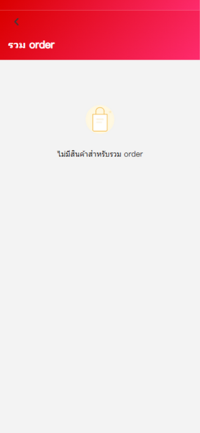

**页面用途**：参与拼团商品以更低价格购买。

**布局**：

| 区域 | 说明 |
|------|------|
| 红粉渐变头部 + 返回 + 标题 `拼团 / Group Buy` | 导航 |
| 商品卡列表 | 图 + 名 + 销量进度条「已售 X/Y」+ 折扣标签 + 拼团价 ฿ + 原价划线 + 「**参与拼团 / Join Group**」按钮 |

**操作**：点击卡片或按钮 → 进入拼团详情页 `pages/group-detail/index?id=X`

---

## 16. 收货地址

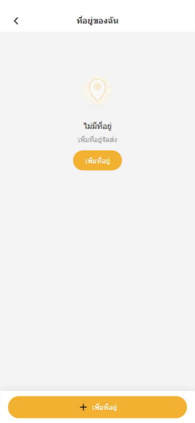

**页面用途**：管理外卖收货地址。

**布局**：

| 区域 | 说明 |
|------|------|
| 标题 `我的地址 / My Address` | 导航 |
| 地址列表 | 每项：姓名 + 电话 + 默认标签 + 详细地址 + 备注 |
| 操作行 | 「设为默认」单选 / 「**编辑**」/ 「**删除**」 |
| 底部固定「**+ 添加地址 / Add Address**」按钮 | 新增地址 |

**新增/编辑弹窗**字段：
- 「**获取定位**」按钮
- 联系人 / 电话
- 地区选择（省/市/县三级，内置泰国曼谷等数据）
- 详细地址 / 门牌号
- 地址标签（🏠 家 / 💼 公司 / 🎓 学校 / 📍 其他）
- 备注
- 「**设为默认**」switch
- 「**保存**」按钮

---

## 17. 设置

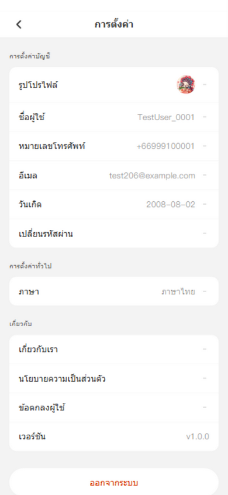

**页面用途**：账号信息、通用设置、关于。

### 👤 账号设置

| 项目 | 操作 |
|------|------|
| 头像 | 点击选图上传（限 5MB） |
| 用户名称 | 点击弹昵称编辑弹窗 |
| 手机号 | 点击进入改手机号流程 |
| 邮箱 | 点击弹邮箱编辑弹窗（含「清空」按钮） |
| 出生日期 | 点击弹日期选择器 |
| 修改密码 | 点击弹密码弹窗（旧密码/新密码/确认密码；未设密码时标题为「设置密码」） |

### ⚙️ 通用设置

| 项目 | 操作 |
|------|------|
| 消息通知 switch（仅 APP） | 开关推送通知 |
| 语言（显示当前语言） | 点击弹语言切换弹窗 |
| 清除缓存（仅 APP，显示「12.5MB」） | 点击弹确认弹窗 |

### ℹ️ 关于

| 项目 | 跳转 |
|------|------|
| 关于我们 | 协议页 |
| 隐私政策 | 协议页 |
| 用户协议 | 协议页 |
| 版本 v1.0.0 | — |

### 🚪 退出登录
- 底部按钮，弹确认框

---

## 18. 常见问题（FAQ）

**Q1：忘记密码怎么办？**
A：在密码登录页点击「忘记密码?」，通过短信验证码验证身份后即可重置密码。

**Q2：如何切换语言？**
A：在登录页右上角点击语言按钮，或在首页点击🌐地球图标，或在「设置 → 语言」中切换。支持中文/English/ภาษาไทย。

**Q3：怎么参与堂食点餐？**
A：首页点击「堂食」入口 → 选择门店 → 浏览菜单点「+」加购 → 点购物车 → 「去结算」→ 提交订单 → 出示二维码给收银员扫码。

**Q4：订单怎么支付？**
A：本 App 采用"先吃后付"模式。提交订单后会生成二维码，到收银台出示二维码扫码即可完成支付。

**Q5：优惠券怎么用？**
A：结算页点击「优惠券 N 张可用」选择可用券，系统自动抵扣。线下核销券在「我的优惠券」点击「线下核销」出示二维码给收银员。注意：酒水订单不参与优惠。

**Q6：金币有什么用？**
A：金币可以在结算页抵扣现金（按档位抵扣），也可以在积分商城兑换商品或换成积分。

**Q7：如何邀请好友获得奖励？**
A：首页「邀请好友」卡片或「我的 → 邀请码」→ 复制邀请码或分享链接发给好友 → 好友注册时填写你的邀请码 → 双方获得金币/积分奖励 → 好友首单后奖励激活。

**Q8：会员等级怎么升级？**
A：通过消费累计金额升级。在「我的」页可查看当前等级、进度条和下一档权益。不同等级享受不同折扣和权益。

**Q9：会员码有什么用？**
A：在「我的 → 会员码」生成动态二维码，出示给收银员可识别你的会员身份，享受会员价、积分等权益。二维码 60 秒有效，过期自动刷新。

**Q10：如何领取新人礼包？**
A：新用户在商城首页分类点击「新人券包」→ 进入新人礼包页 → 可逐张领取或「一键领取全部」。

---

## 📌 附录：页面快速索引

| 功能 | 页面路径 |
|------|----------|
| 首页 | `pages/index/index` |
| 堂食门店 | `pages/dinein-stores/index` |
| 堂食点餐 | `pages/dinein/index` |
| 商城 | `pages/mall/index` |
| 商品列表 | `pages/products/index` |
| 商品详情 | `pages/product-detail/index` |
| 结算 | `pages/checkout/index` |
| 支付成功 | `pages/payment-success/index` |
| 订单列表 | `pages/order/index` |
| 订单详情 | `pages/order-detail/index` |
| 会员中心 | `pages/member/index` |
| 设置 | `pages/settings/index` |
| 收货地址 | `pages/address/index` |
| 优惠券 | `pages/coupons/index` |
| 积分商城 | `pages/points-mall/index` |
| 任务中心 | `pages/tasks/index` |
| 消息 | `pages/message/index` |
| 邀请 | `pages/referral/index` |
| 会员码 | `pages/member-code/index` |
| 新人礼包 | `pages/newbie-gift/index` |
| 拼团 | `pages/group/index` |
| 登录 | `pages/login/index` |

---

> 📝 **文档维护**：本手册基于 App v1.0.11 版本编写，截图取自 H5 开发环境。如页面有更新，请同步更新本手册。
